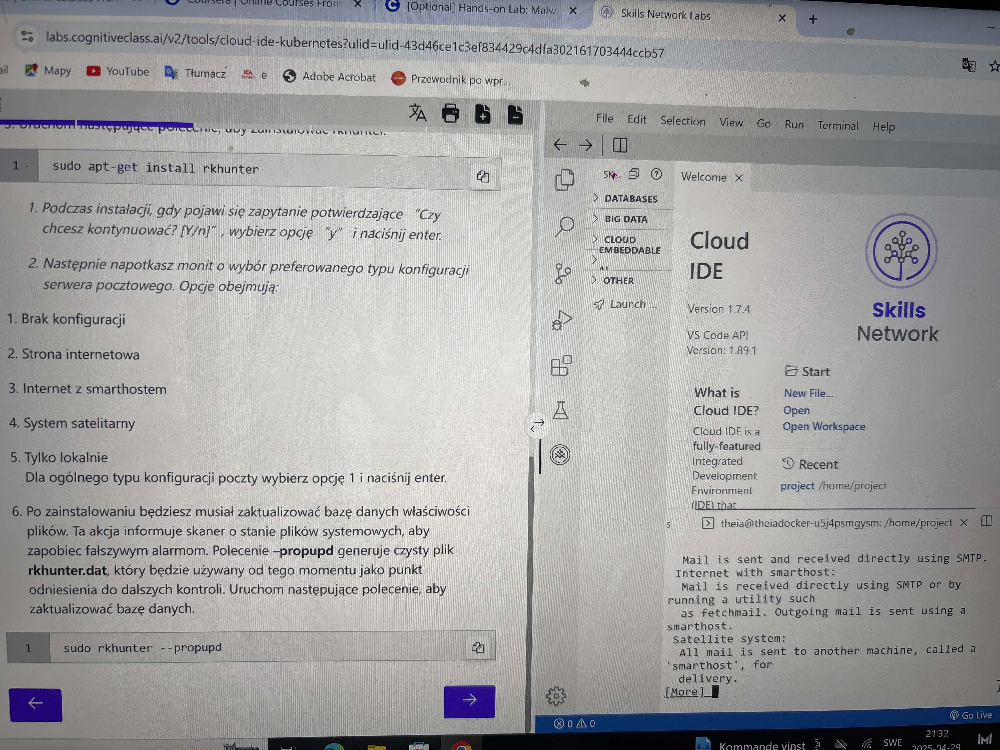
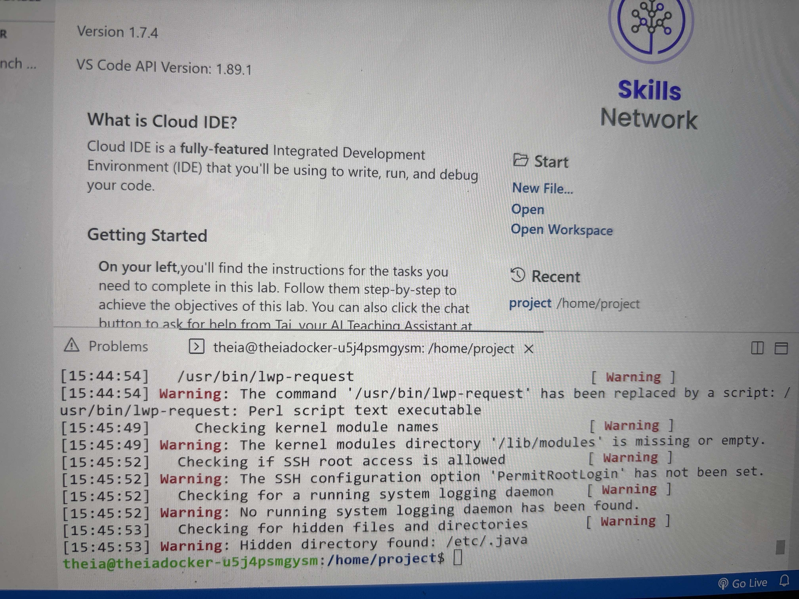

# RKHunter Lab – Rootkit Scanning in Linux

As part of my practical cybersecurity training within the **IBM Cybersecurity Analyst program**, I performed a rootkit scan using the `rkhunter` tool in a cloud-based Linux environment (Skills Network Cloud IDE).

---

## Step 1: Installation

I began by installing the `rkhunter` package and configuring the environment to avoid unnecessary mail server setup.

```bash
sudo apt-get install rkhunter
```

Mail configuration was skipped by selecting the **“No configuration”** option.



---

## Step 2: Database Initialization

Before scanning, I initialized the baseline file properties with the following command:

```bash
sudo rkhunter --propupd
```

This command saves the current state of important system files for future comparison.

---

## Step 3: Running the Scan

```bash
sudo rkhunter --check
```

The scan completed successfully and returned a list of **warnings**, most of which are expected in cloud-based or minimal test environments.

Key findings included:
- Missing kernel module directory (`/lib/modules`)
- No system logging daemon found
- SSH config option `PermitRootLogin` not set
- Hidden Java directory (`/etc/.java`)



---

## Summary

This hands-on lab improved my familiarity with host-based security tools and system integrity verification. The warnings provided a great opportunity to analyze system posture and understand real-world implications of misconfigurations or missing components.

**Tools used:**
- IBM Skills Network Cloud IDE  
- Ubuntu (container-based)  
- `rkhunter`  

---

*Author: Piotr Szewczyk*  
*Date: April 2025*
